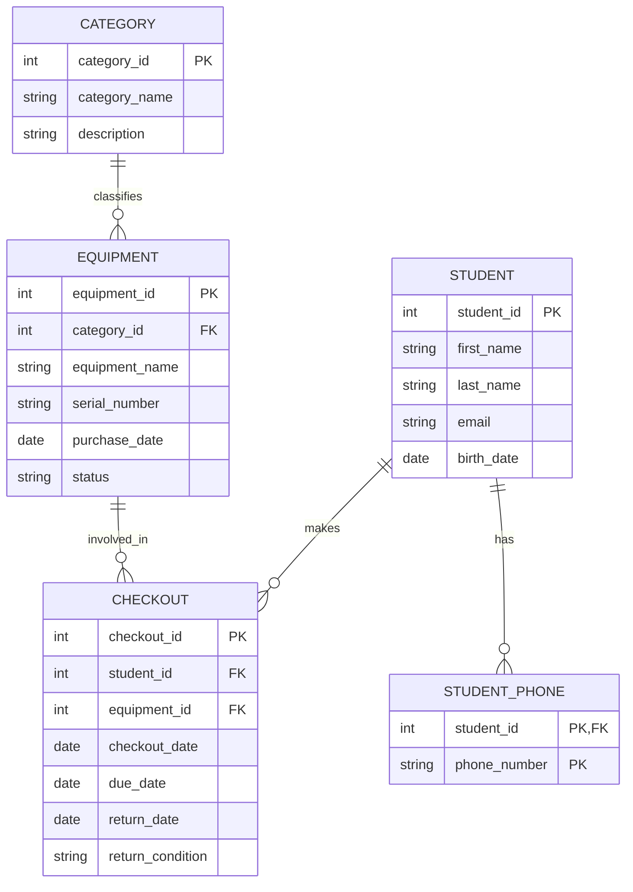

# Campus Equipment Checkout Database

## Part 6: Conceptual ER Diagram

```mermaid
erDiagram
    CATEGORY ||--o{ EQUIPMENT : classifies
    STUDENT ||--o{ CHECKOUT : makes
    EQUIPMENT ||--o{ CHECKOUT : involved_in
STUDENT ||--o{ STUDENT_PHONE : has

STUDENT_PHONE {
    int student_id PK,FK
    string phone_number PK
}

STUDENT {
    int student_id PK
    string first_name
    string last_name
    string email
    date birth_date
}

EQUIPMENT {
    int equipment_id PK
    int category_id FK
    string equipment_name
    string serial_number
    date purchase_date
    string status
}

CATEGORY {
    int category_id PK
    string category_name
    string description
}

CHECKOUT {
    int checkout_id PK
    int student_id FK
    int equipment_id FK
    date checkout_date
    date due_date
    date return_date
    string return_condition
}

```
